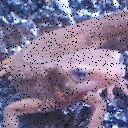

# Q. 1 - 10

## Q.1: Channel Swapping

### Detail: Read the image and change RGB in order of BGR.

It is possible to extract the red component of the image with the following code. **Note that in the cv2.imread () function the channel will be in order of BGR!** The variable red contains only the red component of `imori.jpg`.

```python
import cv2
img = cv2.imread("imori.jpg")
red = img[:, :, 2].copy()
```

|Input (imori.jpg)|Output (answer_1.jpg)|
|:---:|:---:|
|||

answer >> [1_Channel_Swapping.py](./1_Channel_Swapping.py)

## Q.2: Grayscale

### Detail: Make the image grayscale. 

Grayscale is a kind of image luminance expression method and is calculated by the following formula.
$$
Y = 0.2126 R + 0.7152 G + 0.0722 B
$$


|Input (imori.jpg)|Output (answer_2.jpg)|
|:---:|:---:|
|||

Answer >> [2_Grayscale.py](./2_Grayscale.py)

## Q.3: Binarization 

Binarize the image. Binarization is a method of expressing images as binary black and white. Here, the threshold is set to 128 in gray scale and binarized by the following equation.

```python
y = 0 if y < 128 else 255
```

|Input (imori.jpg)|Output (answer_3.jpg)|
|:---:|:---:|
|||

Answer >> [3_Binarization.py](./3_Binarization.py)

## Q.4: Binarization of Otsu

### Detail：Implement Otsu's binarization. 

Otsu's binarization is called a discriminant analysis method, and it is a method to automatically determine the separation threshold in binarization. This is calculated from the ratio **between** **intra-class variance** and **interclass variance** .

- Less than the threshold t is class 0, and equal or more than t is class 1.
- $w_0$, $w_1$: The ratio of the number of pixels of each class separated by the threshold t ($w_0 + w_1 = 1$ is satisfied)
- $S0^2, S1^2$ ... Distribution of pixel values of each class
- $M0, M1$ ... average value of pixel values of each class

```python
Sw^2 = w0 * S0^2 + w1 * S1^2 # Within-class variance
Sb^2 = w0 * (M0 - Mt)^2 + w1 * (M1 - Mt)^2 = w0 * w1 * (M0 - M1) ^2 # Interclass variance
St^2 = Sw^2 + Sb^2 = (const)  # Distribution of pixels of the whole image
# The degree of separation is defined by the following equation. 
X = Sb^2 / Sw^2 = Sb^2 / (St^2 - Sb^2) # Separation degree 
```

Therefore:

```python
argmax_{t} X = argmax_{t} Sb^2
```
 That is, the threshold value t that satisfies $Sb^2 =  w0 * w1 * (M0 - M1) ^2 $ may be used as the binarization threshold.

|Input (imori.jpg)|Output (th = 127) (answer_4.jpg)|
|:---:|:---:|
|||

Answer >> [4_Binarization_of_Otsu.py](./4_Binarization_of_Otsu.py)


## Q.5: HSV Conversion

### Detail: Implement HSV conversion and flip Hue H.

HSV conversion is a method of expressing colors by Hue(色相)**、**Saturation(彩度)**、**Value(明度)** .

- Hue: 
  - Expresses the color tone from 0 to 360 degrees.
  - Indicates the kind of color such as red or blue. (0 <= H <360)
- Saturation: Color vividness. 
  - When the Saturation is low, the grayness becomes conspicuous and it becomes a dull color. (0 <= S <1)
- Value: Brightness of color. 
  - The higher the Value, the closer to white
  - The lower the Value, the closer to black. (0 <= V <1)

The RGB -> HSV conversion is defined by the following equation.

```bash
Max = max(R,G,B)
Min = min(R,G,B)
H =  { 0                            (if Min=Max)
       60 * (G-R) / (Max-Min) + 60  (if Min=B)
       60 * (B-G) / (Max-Min) + 180 (if Min=R)
       60 * (R-B) / (Max-Min) + 300 (if Min=G)
V = Max
S = Max - Min
```

HSV -> RGB conversion is defined by the following equation.

```bash
C = S

H_1 = H // 60

X = C * (1 - abs(H_1 % 2 - 1)

(R,G,B) = (V - C) * (1,1,1) + { (0, 0, 0)  (if H is undefined)
                              (C, X, 0)  (if 0 <= H_1 < 1)
                              (X, C, 0)  (if 1 <= H_1 < 2)
                              (0, C, X)  (if 2 <= H_1 < 3)
                              (0, X, C)  (if 3 <= H_1 < 4)
                              (X, 0, C)  (if 4 <= H_1 < 5)
                              (C, 0, X)  (if 5 <= H_1 < 6)}
```
In this case, invert the hue H (add 180) and display it as RGB and display the image.

|Input (imori.jpg)|Output (answer_5.jpg)|
|:---:|:---:|
|||

Answer >> [5_HSV_Conversion.py](./5_HSV_Conversion.py)

## Q.6: Discretization of Color

### Detail:

Decrease the value of the image from 256 ^ 3 to 4 ^ 3. That is, to each of the four values R, G, B in {32, 96, 160, 224}. This is a quantization operation. For each value, it is defined as follows.

```bash
val = {  32  (0 <= val < 63)
         96  (63 <= val < 127)
        160  (127 <= val < 191)
        224  (191 <= val < 256)
```
|Input (imori.jpg)|Output (answer_6.jpg)|
|:---:|:---:|
|||

Answer >> [6_Discretization_of_Color.py](./6_Discretization_of_Color.py)

## Q.7: Average Pooling

In this case, the image is divided into grids (divide it into certain fixed-length regions), and the value in the region is filled with the average value in the region (cell). The operation of dividing the grid in this way and **obtaining** the representative value in that area is called **pooling** . These pooling operations play an important role in **CNN (Convolutional Neural Network)** .

This is defined by the following equation.

```bash
v = 1/|R| * Sum_{i in R} v_i
```

Here imori.jpg is 128x128, so divide the grid into 8x8 and average pool.

|Input (imori.jpg)|Output (answer_7.jpg)|
|:---:|:---:|
|||

Answer >> [7_Average_Pooling.py](./7_Average_Pooling.py)
## Q.8: Max Pooling

Pool here with the maximum value instead of the average value.

|Input (imori.jpg)|Output (answer_8.jpg)|
|:---:|:---:|
|||

Answer >> [8_Max_Pooling.py](./8_Max_Pooling.py)

## Q.9: Gaussian Filter

Implement the Gaussian filter (3 × 3, standard deviation 1.3) and remove the noise of *imori_noise.jpg* .

The Gaussian filter is a type of filter that performs **smoothing** ( **smoothing** ) of an image, and it is also used for **noise removal**.

Other than this, there are median filter (Q.10), smoothing filter (Q.11), LoG filter (Q.19), and others for removing noise.

The Gaussian filter smoothes surrounding pixels of the pixel of interest by weighting by Gaussian distribution and is defined by the following equation. Such weights are called **kernels** and **filters** .

However, as it is impossible to filter the edges of the image as it is, pixels where the pixels are missing are filled with zeros. This is called **0 padding** . And weights are normalized. (sum g = 1)

```bash
Weight g(x,y,s) = 1/ (s*sqrt(2 * pi)) * exp( - (x^2 + y^2) / (2*s^2))
by the standard deviation s = 1.3 8 neighborhood Gaussian filter is 
            1 2 1
K =  1/16 [ 2 4 2 ]
            1 2 1
```

|Input (imori_noise.jpg)|Output (answer_9.jpg)|
|:---:|:---:|
|||

Answer >> [9_Gaussian_Filter.py](./9_Gaussian_Filter.py)

## Q.10: Median Filter

Implement the median filter (3x3) and remove the noise of *imori_noise.jpg* .

The median filter is a type of filter that performs smoothing of an image.

This is a filter that outputs a median value (median value) within the 3 × 3 region of the target pixel. Zero pad this too.

|Input (imori_noise.jpg)|Output (answer_10.jpg)|
|:---:|:---:|
|||

Answer >> [10_Median_Filter.py](./10_Median_Filter.py)

