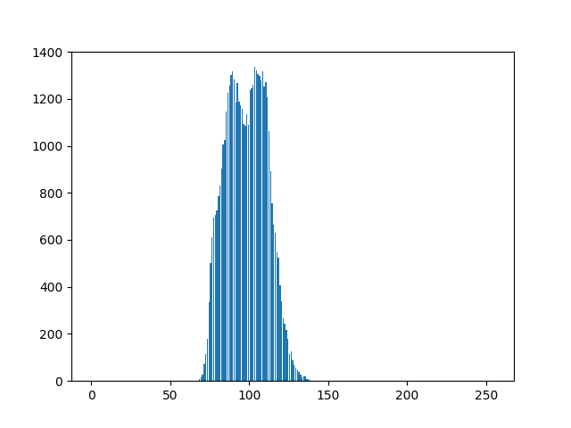

# Q.11 - 20

## Q.11.  Smoothing Filter

### Detail: Implement the smoothing filter (3 x 3).

The smoothing filter is a filter that outputs the average value of the pixels in the filter.

|Input (imori.jpg)|Output (answer_11.jpg)|
|:---:|:---:|
|||

Answer >> [11_Smoothing_Filter.py](./11_Smoothing_Filter.py)


## Q.12. Motion Filter

### Detail: Implement the motion filter (3 x 3).

The motion filter is a filter that takes the average value in the diagonal direction and is defined by the following equation.

```bash
  1/3  0   0
[  0  1/3  0 ]
   0   0  1/3
```

|Input (imori.jpg)|Output (answer_12.jpg)|
|:---:|:---:|
|||

Answer >> [12_Motion_Filter.py](./12_Motion_Filter.py)

## Q.13. Max-Min Filter

### Detail：Implement the Max-Min filter (3 x 3).

The Max-Min filter is a filter that outputs the difference between the maximum value and the minimum value of pixels in the filter, and is one of the filters for **edge detection** . Edge detection is to detect a line in an image, and an operation to extract information in such an image is called **feature extraction** . For edge detection, filtering is performed on grayscale images in many cases.

|Input (imori.jpg)|Output (answer_13.jpg)|
|:---:|:---:|
|||

Answer >> [13_Max_Min_Filter.py](./13_Max_Min_Filter.py)


## Q.14. Differential Filter

### Detail：Implement differential filter (3 x 3).

The differential filter is a filter that extracts the edge of the portion where the abrupt change in luminance occurs and takes the difference between the adjacent pixels.

```bash
(a)Vertical Direction      (b)Horizontal Direction
      0 -1  0                        0 0 0
K = [ 0  1  0 ]               K = [ -1 1 0 ]
      0  0  0                        0 0 0
```

|Input (imori.jpg)|Output・Vertical direction (answer_14_v.jpg)|Output・Horizontal direction (answer_14_h.jpg)|
|:---:|:---:|:---:|
||||

Answer >> [14_Differential_Filter.py](./14_Differential_Filter.py)

## Q.15. Sobel Filter

### Detail: Implement the Sobel filter (3x3).

The Sobel filter (Sobel filter) is a filter that extracts only edges in a specific direction (vertical and horizontal), and is defined by the following equation.

```bash
(a)Horizontal Direction      (b)Vertical Direction
      1 0 -1                         1  2  1
K = [ 2 0 -2 ]                K = [  0  0  0 ]
      1 0 -1                        -1 -2 -1
```

|Input (imori.jpg)|Output・Vertical direction (answer_15_v.jpg)|Output・Horizontal direction (answer_15_h.jpg)|
|:---:|:---:|:---:|
||||

Answer >> [15_Sobel_Filter.py](./15_Sobel_Filter.py)

## Q.16.  Prewitt Filter

### Detail: Implement the Prewitt filter (3x3).

The Prewitt filter is a type of edge extraction filter and is defined by the following equation.

```bash
(a)Vertical Direction      (b)Horizontal Direction
      -1 -1 -1                      -1 0 1
K = [  0  0  0 ]              K = [ -1 0 1 ]
       1  1  1                      -1 0 1
```

|Input (imori.jpg)|Output・Vertical Direction(answer_16_v.jpg)|Output・Horizontal Direction (answer_16_h.jpg)|
|:---:|:---:|:---:|
||||

Answer >> [16_Prewitt_Filter.py](./16_Prewitt_Filter.py)


## Q.17. Laplacian Filter

### Detail：Implement the Laplacian filter.

The Laplacian (Laplacian) filter is a filter that performs edge detection by taking the second derivative of luminance.

Since the digital image is discrete data, the first-order derivatives in the x direction and the y direction are expressed by the following equations, respectively.

```bash
Ix(x,y) = (I(x+1, y) - I(x,y)) / ((x+1)-x) = I(x+1, y) - I(x,y)
Iy(x,y) = (I(x, y+1) - I(x,y)) / ((y+1)-y) = I(x, y+1) - I(x,y)
```

Further, the second derivative is expressed by the following equation.

```bash
Ixx(x,y) = (Ix(x,y) - Ix(x-1,y)) / ((x+1)-x) = Ix(x,y) - Ix(x-1,y)
         = (I(x+1, y) - I(x,y)) - (I(x, y) - I(x-1,y))
         = I(x+1,y) - 2 * I(x,y) + I(x-1,y)
Iyy(x,y) = ... = I(x,y+1) - 2 * I(x,y) + I(x,y-1)
```

From these, Laplacian is defined by the following equation.

```bash
D^2 I(x,y) = Ixx(x,y) + Iyy(x,y)
           = I(x-1,y) + I(x,y-1) - 4 * I(x,y) + I(x+1,y) + I(x,y+1)
```

When it is kernelized, it becomes as follows.

```bash
      0  1  0
K = [ 1 -4  1 ]
      0  1  0
```

|Input (imori.jpg)|Output(answer_17.jpg)|
|:---:|:---:|
|||

Answer >> [17_Laplacian_Filter.py](./17_Laplacian_Filter.py)

## Q.18. Emboss Filter

### Detail: Implement the Emboss filter.

The Emboss filter is a filter that embosses outline parts and is defined by the following equation.

```bash
      -2 -1  0
K = [ -1  1  1 ]
       0  1  2
```

|Input (imori.jpg)|Output(answer_18.jpg)|
|:---:|:---:|
|||

Answer >> [18_Emboss_Filter.py](./18_Emboss_Filter.py)

## Q.19. LoG Filter

### Detail: Implement the LoG filter (s = 3) and detect the edge of *imori_noise.jpg* .

The LoG filter is the Laplacian of Gaussian, which filters the image with the Gaussian filter and then takes out the outline with the Laplacian filter.

Since the Laplcian filter takes a second derivative, noise is suppressed in advance by a Gaussian filter in order to prevent noise from being emphasized.

The LoG filter is defined by the following equation.

```bash
LoG(x,y) = (x^2 + y^2 - s^2) / (2 * pi * s^6) * exp(-(x^2+y^2) / (2*s^2))
```

|Input (imori.jpg)|Output (answer_19.jpg) |
|:---:|:---:|
|||

Answer >> [19_LoG_Filter.py](./19_LoG_Filter.py)
## Q.20. Histogram Display

### Detail: Use matplotlib to display the histogram of *imori_dark.jpg* .

A histogram is a graph of the appearance frequency of pixels. In matplotlib, there is already a function called hist (), so use it.

|Input (imori_dark.jpg)|Output (answer_20.png) |
|:---:|:---:|
|||

Answer >> [20_Histogram_Display.py](./20_Histogram_Display.py)

