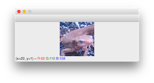
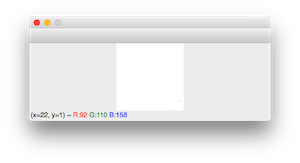
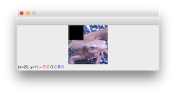
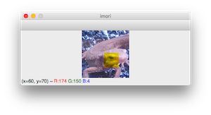
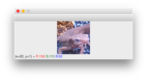

# Tutorial

Here, we will introduce some basic usage of numpy in image processing.

**Numpy** is a type of package prepared by python (something like a library in C).

In addition, there is a library called **OpenCV** in image processing, and it has various APIs.

In this tutorial, I am aiming to implement OpenCV processing with my own hands by tinkering with numpy.

Please do it in interpreter form instead of .py file from here.

## Start Python

1. Be sure to activate your virtual environment using the following command:

   ```bash
   source activate Image_Processing_100
   ```

2. Then type "python".

```bash
Python 3.6.7 |Anaconda, Inc.| (default, Oct 23 2018, 14:01:38)
[GCC 4.2.1 Compatible Clang 4.0.1 (tags/RELEASE_401/final)] on darwin
Type "help", "copyright", "credits" or "license" for more information.
>>>
```
## Import

We will install the package from here. We import cv2 for OpenCV and numpy for numpy respectively. (Numpy is often used as np)

```bash
>>> import cv2
>>> import numpy as np
```

## Image Reading and Display

It is `cv2.imread()` to read the image. To read *imori.jpg*:

```bash
>>> img = cv2.imread("./assets/imori.jpg")
```

The image information is saved in the variable img in numpy format.

Use `img.shape` to get image size information. This is in order of (height, width, channel), meaning 128 pixels wide, 128 pixels wide, 3 channels (blue, green, red).

```bash
>>> img.shape
(128, 128, 3)
```

To take a type, use `img.dtype`.  `uint8 `is an unsigned int and means 8 bits. The image is expressed in 256 steps, usually 0 to 255, each of RGB components. For example, the red pixel is (R, G, B) = (255, 0, 0), white is (R, G, B) = (255, 255, 255). When I make it to an image, the image will be wrong unless I make it to this type without fail. (I will explain it later.)

```bash
>>> img.dtype
dtype('uint8')
```

To display images, use cv2.imshow (). The first argument to cv2.imshow () requires the name of the window (you do not have to worry about it) and the second argument requires an image.

`**cv2.waitKey(0) `has the function of displaying an image until something is input from the keyboard.

```bash
>>> cv2.imshow('', img); cv2.waitKey(0)
```

|Display(sample1.png)|
|:---:|
||

For example, change the img type to float32. This can be done with img.astype ().

```bash
>>> _img = img.astype(np.float32)
```

When this is displayed, it becomes like this. That is, the display will be incorrect as the mold becomes strange. (However, you can save it.) So, when dealing with images,

1. Read with `cv2.imread()`.
2. The mold **is converted once to point type, such as `np.float32`**.
3. Fiddling with images.
4. **If the pixel is less than 0, it is 0, and if it exceeds 255 it is fixed to 255.** (Super important)
5. It is recommended that you **convert the** type to **`np.uint8`, display and save it** This procedure is recommended.

We will introduce about 4 in the next chapter "Fiddling with pixels".

```bash
>>> cv2.imshow('', _img); cv2.waitKey(0)
```
|Display(sample2.png)|
|:---:|
||

## Pixel Level Manipulation

Image manipulation is almost the same as numpy.

For example, if you want to deal with pixel values of x = 30, y = 20, do this. Pixel values are arranged in order of BGR. Type array() means it is in numpy format. That is, OpenCV is a wrapper around numpy.

```bash
>>> img[20, 30]
array([232, 178, 171], dtype=uint8)
```

Furthermore, when taking the G component of x = 30, y = 20, do this.

```bash
>>> img[20, 30, 1]
178
```

From here, I will enter the main subject of numpy.

Numpy has a function called **slice** . This means that you can access all elements from a value v1 to a certain value v2.

For example, to see y = 20, x = [30, 32], do this. If it is 30:33 it can be taken out as a matrix. By setting a: b, you can access the value of a <= v <b. By the way, if you set it to 30, you can get [0, 30], 30: and you can extract up to [30, last].

```bash
>>> img[20, 30:33]
array([[232, 178, 171],
[209, 156, 153],
[134,  85,  77]], dtype=uint8)
```

For example, to make the upper left of the image (x = [0, 50], y = [0, 50]) black can be done like this. copy() is described below.

```bash
>>> img2 = img.copy()
>>> img2[:50, :50] = 0
>>> cv2.imshow("", img2); cv2.waitKey(0)
```

|Display(sample3.png)|
|:---:|
||

Next, **If the pixel is less than 0, it is 0, and if it exceeds 255 it is fixed to 255.**  I will explain.

For example, let's change the B component of a part to a value of 260 by making the image a float 32 type once.  `uint8 `type can only take the range of [0, 255], so if you convert this to `uint8 `type, it will be like this. A part of the newt's face has become yellow.

**This is because when 260 is converted to `uint8 `type, 260 - 256 occurs and B = 4.** This often causes pixel values to be incorrect. So, operation of 4 is necessary.

```bash
>>> img2 = img.copy().astype(np.float32)
>>> img2[60:100, 60:100, 0] = 260
>>> cv2.imshow("imori", img2.astype(np.uint8)); cv2.waitKey(0)
```

|Display (sample5.png)|
|:---:|
||

## Copy Image

Let's use copy() when you want to copy the image to another variable.

```bash
>>> img2 = img.copy()
```

Simply setting `img2 = img` will save the address of the image, so if you change img2, it will be reflected in img too.

If there is no special use, **let's copy the image with copy()** .

## Save Image

Let's use cv2.imwrite() for saving.

Let's do this, for example, when saving the previous img2 as *`sample.jpg`* . If it is true, it is successfully saved, so that a file called `sample.jpg` is created in the same folder.

```bash
>>> cv2.imwrite("sample.jpg", img2)
True
```

## Practice

Let's replace R and B on the left half of the image and display it.

Answer

```bash
>>> import cv2
>>> img = cv2.imread("./assets/imori.jpg")
>>> img3 = img.copy()
>>> H, W, C = img3.shape
>>> img3[:H//2, :W//2] = img3[:H//2, :W//2, (2, 1, 0)]
>>> cv2.imshow('', img3); cv2.waitKey(0)
```

|Display (sample4.png)|
|:---:|
||

That concludes the tutorial.

Please solve the problem as well! ! ! !
